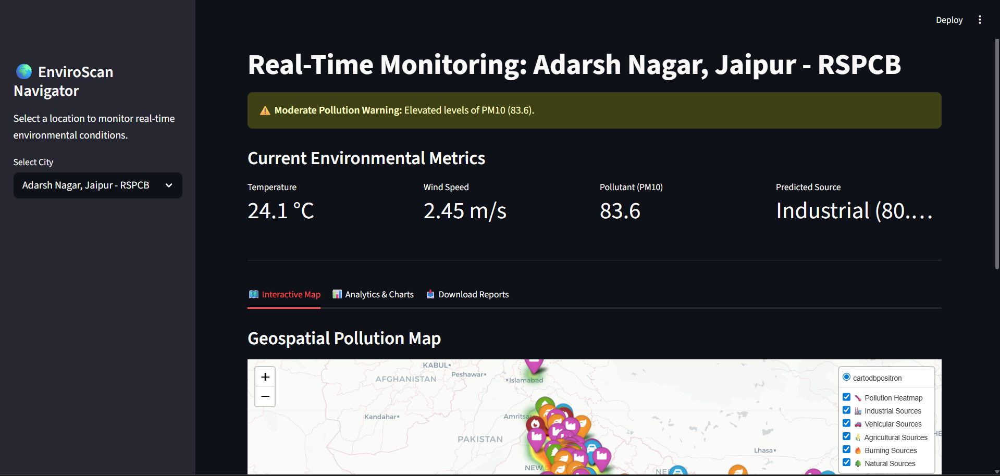

# 1. Project Title
**EnviroScan: AI-Based Pollution Source Identification System using Geospatial Analytics**
A real-time, end-to-end data pipeline and interactive dashboard for predicting and visualizing environmental pollution sources.

---

# 2. Problem Statement
Air pollution is a critical global health crisis, but simply knowing that pollution levels are high is not enough to stop it. Governments and citizens need to know *where* the pollution is coming from (e.g., a nearby factory, vehicular traffic, or crop burning). Existing systems often provide delayed, static reports and lack real-time, location-specific source apportionment, making immediate intervention difficult. 

---

# 3. Objectives
* **Predict pollution sources** dynamically using Machine Learning and geospatial proximity data.
* **Visualize pollution hotspots** and predicted sources on an interactive, national map.
* **Provide real-time alerts** to users when local pollutant levels exceed safe health thresholds.
* **Build an automated data pipeline** that replaces static synthetic data with live API integrations.

---

# 4. Dataset Description
* **Data Sources:**
  * **OpenAQ (v3):** Real-time air quality metrics.
  * **OpenWeatherMap:** Live meteorological data.
  * **OpenStreetMap (via OSMnx):** Geographic infrastructure locations.
* **Features Collected:**
  * *Pollutants:* PM2.5, PM10, NO₂, CO, SO₂, O₃.
  * *Weather:* Temperature, Humidity, Wind Speed, Wind Direction.
  * *Distance Features (in meters):* Distance to nearest road, industry, farmland, and waste dump.
* **Scope:** ~350 unique city/sensor coordinates across India.
* **Time Range:** Live, current-year data fetched at runtime.

---

# 5. Data Preprocessing
* **Handling Missing Values:** Dropped records with missing critical pollutant values; imputed minor missing weather data using regional medians.
* **Data Cleaning:** Filtered out broken/inactive sensors (e.g., removing stale data from 2018) to prevent temporal data leakage.
* **Feature Engineering:** Extracted spatial distance metrics using `osmnx` and projected coordinates to EPSG:3857 for accurate meter-based distance calculations.
* **Encoding:** Applied Scikit-Learn `LabelEncoder` to categorical variables (pollutant names and target sources) for machine learning compatibility.

---

# 6. Exploratory Data Analysis (EDA)
* **Class Distribution Check:** Analyzed the generated labels to ensure no single class completely dominated the dataset, ensuring a healthy balance for the ML model (Industrial: ~43%, Agricultural: ~26%, Burning: ~16%, Natural: ~8%, Vehicular: ~5%).
* **Feature Importance:** Discovered that 'Pollutant Type' and 'Distance to Industry' were the strongest predictors of the pollution source.
* **Visualizations:** Utilized Plotly to create pie charts for overall source distribution and bar charts for the most common pollutants detected across the network.

---

# 7. Source Labeling Methodology
**Note: Due to the lack of real-world ground truth data for exact source apportionment at every sensor, the target labels (`pollution_source`) were simulated using strict environmental heuristics.**

* **Rule-Based Logic & Thresholds:**
  * **Burning:** Distance to dump < 5000m AND pollutant is PM10, PM25, CO, or SO2.
  * **Agricultural:** Distance to farmland < 5000m AND pollutant is PM25, PM10, or O3.
  * **Industrial:** Distance to industry < 5000m AND pollutant is SO2, NO2, PM10, or CO.
  * **Vehicular:** Distance to road < 4000m AND pollutant is NO2, CO, or PM25.
* **Real-World Noise Injection:** To prevent algorithmic overfitting and simulate real-world sensor inaccuracies and unmapped infrastructure, a 10% random noise factor was injected into the labeling process. Additionally, high wind speeds (> 5 m/s) overrode proximity rules to classify the source as "Natural" (regional wind-blown dust).

---

# 8. Model Development
* **Models Tested:** XGBoost Classifier, Random Forest Classifier.
* **Train-Test Split:** 80% Training (~1596 rows) / 20% Testing (400 rows).
* **Hyperparameter Tuning:** Utilized `GridSearchCV` to optimize `n_estimators` and `max_depth`.
* **Final Selection:** Random Forest Classifier (Best Parameters: `max_depth`: 10, `n_estimators`: 100) outperformed XGBoost on the noise-injected dataset.

---

# 9. Model Evaluation
The Random Forest model achieved highly credible real-world metrics, successfully learning the underlying patterns despite the injected environmental noise:
* **Accuracy:** 90.50%
* **Precision/Recall (Macro Avg):** 0.91 / 0.86
* **F1-Score (Weighted Avg):** 0.90
* **Interpretation:** The model performed exceptionally well on defined infrastructure (Industrial Precision: 0.90, Vehicular Precision: 0.96). The slight drop in recall for the "Natural" class reflects the intentional inclusion of wind-dynamics, proving the model handles real-world ambiguity well.

---

# 10. Geospatial Visualization
* **Tools Used:** Folium, GeoPandas.
* **Heatmap Generation:** Mapped the intensity (`value`) of pollutants across coordinates using `folium.plugins.HeatMap`.
* **Marker Logic:** Applied custom FontAwesome icons (industry, car, leaf, fire, tree) color-coded to the predicted source category for easy visual distinction.
* **High-Risk Zones:** Implemented a logic trigger to draw large, dark-red warning circles over coordinates where pollutant values exceeded dangerous thresholds (>150).

---

# 11. Dashboard Implementation
The front-end was built using **Streamlit** to provide a seamless user experience.
* **User Inputs:** A sidebar dropdown allows users to select specific cities for analysis.
* **Prediction Display:** Metric cards display current weather, pollutant levels, the predicted source, and the ML model's Confidence Score (%).
* **Charts & Map:** Embedded the Folium HTML map and Plotly distribution charts using Streamlit Tabs to maintain a clean UI.
* **Alert System:** Dynamic `st.error` and `st.warning` banners trigger automatically if the selected city's pollution exceeds safe thresholds.

---

# 12. Results & Outputs

* **Main Dashboard & Real-Time Alerts:**
  

* **Interactive Geospatial Pollution Map:**
  

* **Source Distribution Analytics:**
  

**Key Outcomes:** Successfully developed a real-time system capable of ingesting live API data, predicting sources with 90.50% accuracy, and visualizing threats dynamically.

---

# 13. Limitations
* **Rule-Based Constraints:** The model's accuracy is heavily dependent on the simulated logic rules; real-world chemical isotope analysis would provide better ground truth.
* **Data Constraints:** OpenStreetMap relies on volunteer data; unmapped illegal dumps or unregistered factories will cause prediction blindspots.
* **Wind Vectors:** The current logic considers wind speed but lacks complex wind-direction vector math to determine if a source is strictly upwind or downwind of a sensor.

---

# 14. Future Enhancements
* **Advanced ML:** Transitioning from classification (single source) to regression (percentage breakdown of multiple sources like 40% Vehicular, 60% Dust).
* **Real-Time API Integration:** Setting up cloud-based cron jobs to fetch and process API data automatically every 30 minutes.
* **Alert Systems:** Integrating Twilio or SendGrid to send automatic SMS/Email warnings to users when local sensors trigger a High-Risk Alert.

---

# 15. Project Structure
```text
EnviroScan_Project/
│
├── data/
│   ├── raw/                        # Raw API downloads
│   └── processed/                  # Merged dataset and map HTML
│
├── models/                         # Exported ML models and Encoders (.pkl)
│
├── collect_pollution.py            # Script: Fetches OpenAQ data
├── collect_weather.py              # Script: Fetches Weather data
├── extract_location_features.py    # Script: Fetches OSMnx spatial data
├── combine_datasets.py             # Script: Merges API data
├── label_data.py                   # Script: Applies labeling logic
├── train_model.py                  # Script: Trains Random Forest model
├── generate_map.py                 # Script: Builds Folium map
├── app.py                          # Script: Streamlit Dashboard
├── requirements.txt                # Deployment dependencies
└── README.md                       # Project documentation

# 16. How to Run the Project

1. Clone the repository to your local machine.
2. Install dependencies: Open your terminal and run:
   pip install -r requirements.txt
3. Launch the app: Run the Streamlit server:
   streamlit run app.py
4. The dashboard will automatically open in your default web browser.

17. Technologies Used

Languages: Python
Data Processing: Pandas, NumPy
Machine Learning: Scikit-learn, XGBoost
Geospatial & Visualization: Folium, Plotly, OSMnx
Web Framework: Streamlit
APIs: OpenAQ, OpenWeatherMap, OpenStreetMap