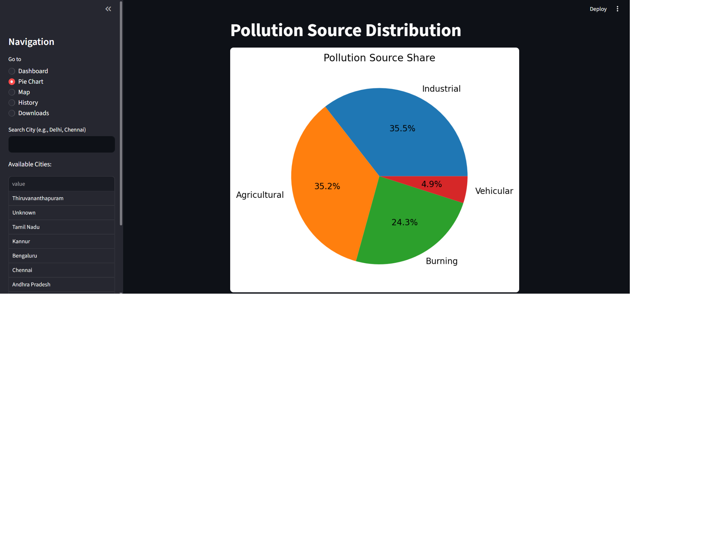
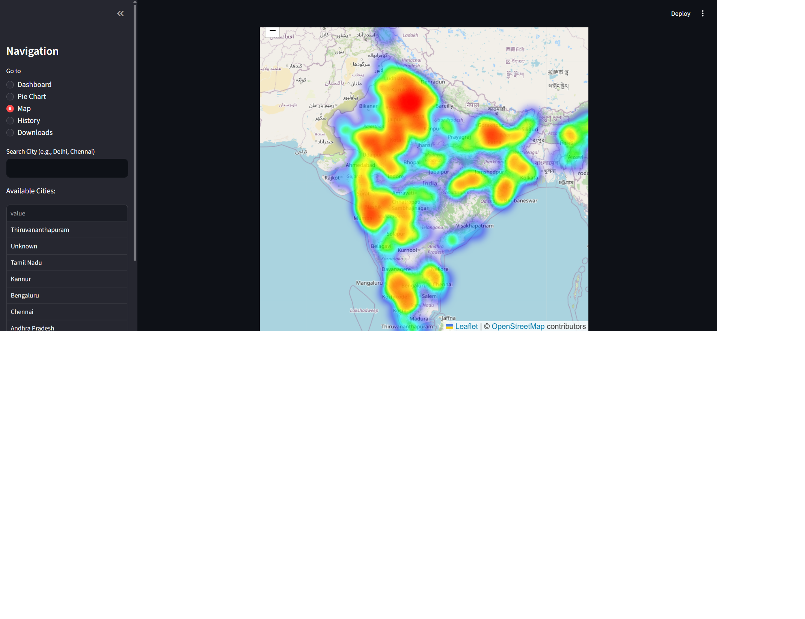
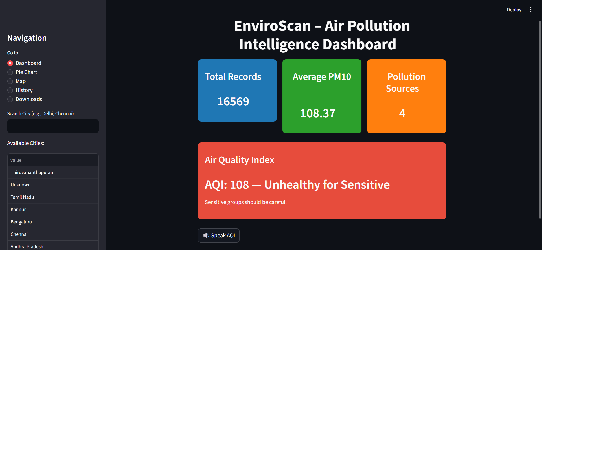

EnviroScan – Air Pollution Intelligence Dashboard

Project Overview:
EnviroScan is an AI-powered system designed to identify and visualize sources of air pollution using environmental data. The system combines pollution data, weather parameters, and location-based features to predict pollution sources and display them through an interactive dashboard.

Problem Statement:
Air pollution monitoring systems provide pollutant values but do not clearly identify the source of pollution such as vehicular or industrial. This makes it difficult to take proper actions.
This project aims to solve this problem by predicting pollution sources using machine learning and visualizing them geographically.

Objectives:

.Predict pollution sources using machine learning
.Visualize pollution hotspots on maps
.Provide insights using environmental data
.Enable location-based filtering in dashboard

Dataset Description:
Due to limitations in real-time API access, a Kaggle dataset (static data) was used.

Data includes:

.Pollutants: PM10, NO2, SO2, CO, O3
.Weather: temperature, humidity, wind speed
.Location features: distance to road, industry, farmland, dump sites

Locations:
City names were obtained using latitude and longitude through reverse geocoding.

Data Preprocessing:

.Removed missing values
.Converted pollutant rows into columns using pivot operation
.Merged pollution, weather, and location datasets
.Filled missing values with 0
.Added location column using latitude and longitude

Exploratory Data Analysis:

.Observed pollution distribution
.Identified dominant pollutant values
.Noticed imbalance in pollution source categories

Source Labeling Methodology:
Since real-world labeled data was not available, rule-based labeling was applied.

Pollution Sources:
- Vehicular
- Industrial
- Agricultural
- Burning

Labeling logic:

.High NO2 and near road → Vehicular
.High SO2 or near industry → Industrial
.High PM10 → Agricultural
.Moderate PM10 or near dump → Burning

Note: Labels are simulated because real ground truth data is not available.

Model Development
Models used:

.Decision Tree
.Random Forest (final model)

Approach:

.Train-test split (80:20)
.Hyperparameter tuning using GridSearch

Model Evaluation:
Metrics used:

.Accuracy
.Precision
.Recall
.F1-score

The model achieved high accuracy because the labels were rule-based and patterns were clearly defined.

Feature Importance:
Random Forest was used to identify important features affecting pollution prediction.

Geospatial Visualization:
Tools used:

.Folium
.HeatMap

Features:

.Pollution heatmap based on PM10
.Source-specific markers
.High-risk zones
.Interactive map

Dashboard Implementation
Built using Streamlit.

Features:

.Search by city/location
.Pollution source prediction
.Heatmap visualization
.Charts and trends
.Dataset download option
.Voice-based AQI output using text-to-speech

Results and Outputs

.Successfully predicted pollution sources
.Visualized pollution hotspots
.Built an interactive dashboard

Limitations

.No real-time API integration
.Rule-based labeling instead of real data
.Static dataset used

Future Enhancements:

.Integrate real-time APIs
.Use advanced machine learning models
.Improve labeling using real data
.Enhance location accuracy

Project Structure:

data/
raw/
processed/

scripts/
models/
dashboard/
README

How to Run the Project:

Install dependencies:
pip install -r requirements.txt

Run model:
python scripts/train_model.py

Run dashboard:
streamlit run dashboard/app.py

Technologies Used:

.Python
.Pandas
.NumPy
.Scikit-learn
.Folium
.Streamlit
.Geopy
.pyttsx3

Conclusion:
EnviroScan shows how environmental data and machine learning can be used together to identify pollution sources and provide useful insights through visualization.

Project Screenshots:

Dashboard Overview

Pollution Distribution (Pie Chart)

Geospatial Heatmap

Voice-enabled AQI Feature
