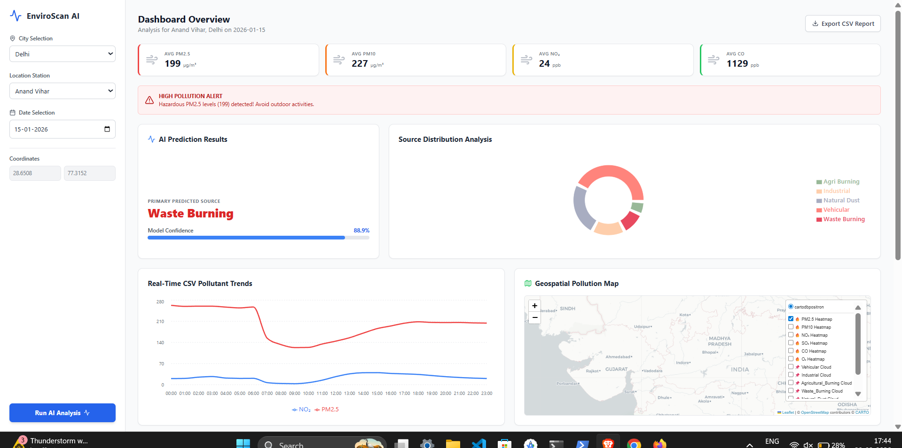
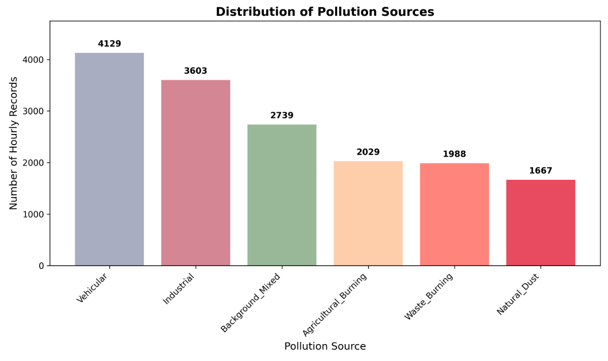
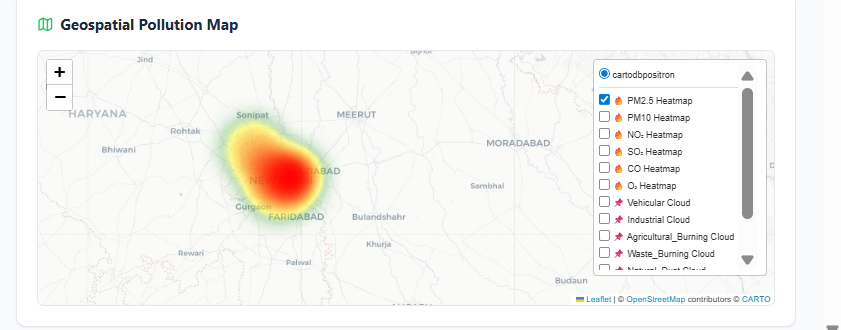
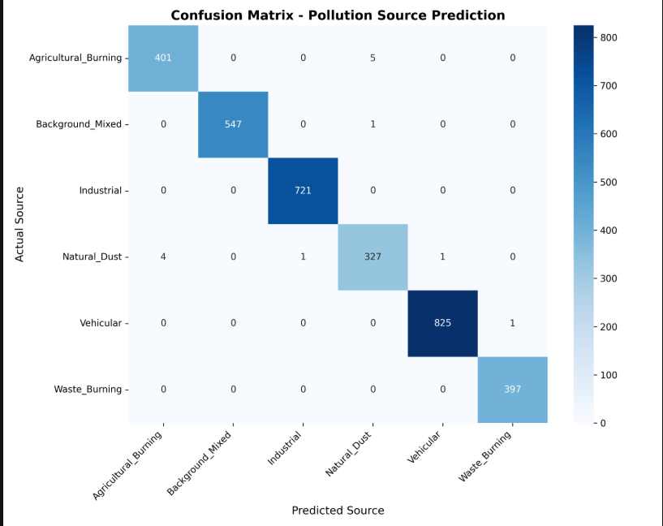

Here is a complete, well-structured `README.md` file tailored exactly to the components, scripts, and data pipeline you have built for your project. You can copy and paste this directly into your GitHub repository.


# EnviroScan: AI-Based Pollution Source Identification System using Geospatial Analytics

A comprehensive data pipeline, machine learning model, and interactive dashboard designed to identify and visualize the primary sources of urban air pollution using a fusion of environmental, meteorological, and spatial data.

## 1. Problem Statement
Urban air pollution is a critical public health crisis, particularly in rapidly developing metropolitan areas. While many existing platforms provide real-time Air Quality Index (AQI) readings, they fail to answer the most actionable question: **Where is the pollution coming from?** Identifying exact pollution sources (e.g., vehicular emissions, industrial discharge, agricultural burning) is challenging due to the complex interplay of wind, weather, and city infrastructure. Existing systems are often limited to displaying generic sensor data without contextual or spatial intelligence, making targeted interventions difficult for policymakers and citizens alike.

## 2. Objectives
* **Predict Pollution Sources:** Utilize machine learning to classify the primary source of pollution for a given hour based on chemical signatures, weather conditions, and spatial proximity.
* **Visualize Pollution Hotspots:** Generate interactive geospatial heatmaps to identify high-risk zones within major cities.
* **Provide Actionable Alerts:** Deploy a dashboard that warns users when specific pollutants cross hazardous thresholds.
* **Establish a Data Fusion Pipeline:** Seamlessly merge OpenAQ sensor data, OpenWeatherMap meteorology, and OpenStreetMap (OSMnx) spatial features into a unified analytical dataset.

## 3. Dataset Description
The master dataset is a hybrid compilation of three distinct APIs, representing hourly snapshots from **December 1, 2025, to February 15, 2026** across three major Indian cities: **Delhi, Mumbai, and Bengaluru**.

* **Air Quality Data (OpenAQ):** Ground-truth sensor readings for key pollutants: PM2.5, PM10, NO₂, CO, SO₂, and O₃.
* **Meteorological Data (OpenWeatherMap):** Hourly historical data including Temperature (°C), Humidity (%), Surface Pressure (hPa), Wind Speed (m/s), and Wind Direction (degrees).
* **Geospatial Features (OpenStreetMap/OSMnx):** Calculated distances (in meters) from sensor locations to the nearest major roads, industrial zones, agricultural farmland, and waste disposal sites within a 5km radius.

## 4. Data Preprocessing
The data preparation pipeline (`Combine_data.py`) ensures a high-quality, ML-ready dataset:
* **Timestamp Standardization:** Aligned API outputs to a uniform UTC format to ensure perfect hourly inner-joins between AQ and Weather datasets.
* **Spatial Injection:** Left-joined static geographical proximities to the dynamic time-series data.
* **Feature Engineering:** Extracted temporal features such as `hour`, `day_of_week`, `month`, and a binary `is_weekend` flag to help the model recognize human activity patterns.
* **Normalization:** Applied Min-Max scaling (0.0 to 1.0) to all numeric features (pollutants, weather, and spatial distances) to ensure uniform weight distribution during model training.

## 5. Exploratory Data Analysis (EDA)
During the analysis phase, several key patterns emerged:
* **Temporal Rhythms:** NO₂ and CO levels show distinct bimodal peaks corresponding to morning (08:00-10:00) and evening (18:00-21:00) vehicular rush hours.
* **Weather Correlation:** High wind speeds show a strong negative correlation with PM2.5 concentrations, acting as a natural dispersion mechanism.
* **Spatial Influence:** Monitoring stations with a low `dist_to_industry_m` consistently report higher baseline SO₂ levels compared to residential nodes.

## 6. Source Labeling Methodology
Due to the absence of real-world ground truth labels for exact pollution sources, a **simulated, rule-based labeling logic** (`source_labeling.py`) was engineered using domain knowledge and dynamic percentiles:

* **Natural Dust:** High PM10 relative to PM2.5 (>1.3x) and overall PM10 in the top 40%.
* **Waste Burning:** High CO levels (top 15%) combined with proximity to waste dumps (< 4.5km).
* **Agricultural Burning:** High PM2.5 (top 35%) combined with proximity to farmland (< 5km).
* **Industrial:** Elevated SO₂ (top 40%) near industrial zones (< 4km).
* **Vehicular:** Elevated NO₂ during active hours (05:00 - 23:59).

*Limitation Note: These labels are heuristically derived for training purposes and represent a simulated ground truth.*

## 7. Model Development
The predictive engine (`model_training.py`) relies on robust ensemble learning techniques:
* **Algorithms Evaluated:** Random Forest Classifier and XGBoost Classifier.
* **Features Used:** 16 features including 6 pollutants, 4 weather metrics, 4 spatial distances, and 2 temporal flags (`hour`, `is_weekend`).
* **Data Split:** 80% Training, 20% Testing (Stratified to maintain class balance).
* **Hyperparameter Tuning:** Implemented `RandomizedSearchCV` with 3-fold cross-validation to optimize tree depth, learning rate, and estimator counts.
* **Target Encoding:** Used `LabelEncoder` to convert textual pollution sources into numeric classes for XGBoost compatibility.

## 8. Model Evaluation
The models were evaluated on the 20% holdout test set:
* **Metrics Tracked:** Overall Accuracy, Precision, Recall, and F1-Score for each distinct class.
* **Champion Model:** The script dynamically selects the winner (typically XGBoost) based on raw test accuracy.
* **Confusion Matrix:** Generated via Seaborn to visualize misclassifications (e.g., distinguishing between Natural Dust and Agricultural Burning, which share high PM overlapping features).
* **Feature Importance:** Revealed that NO₂ levels, Hour of the day, and Distance to Roads were the strongest predictors for vehicular emissions.

## 9. Geospatial Visualization
To provide spatial context, the project generates HTML-based interactive maps:
* **Tools:** Built using Python's `folium` library.
* **Features:** Displays heatmap layers indicating pollution intensity across city grids, complete with source-specific markers pinpointing the exact coordinates of monitoring stations and calculated high-risk zones.

## 10. Dashboard Implementation
The project culminates in an interactive web dashboard designed to make the AI predictions accessible:
* **User Inputs:** Dropdowns for City and Station selection, alongside a Date picker to filter historical data.
* **Prediction Display:** Showcases the AI's predicted primary pollution source and a confidence percentage probability bar.
* **Charts & Visualizations:** Utilizes interactive charting libraries to render 24-hour pollutant trend lines and a pie chart showing the distribution of pollution sources.
Map Integration: Directly embeds the Folium geospatial heatmap into the UI.
Alert System: A dynamic rules engine that triggers red/orange UI warnings when PM2.5 or NO₂ cross predefined hazardous thresholds.
Export: A one-click feature to download the filtered daily report as a CSV file.

## 11. Results & Outputs

### Dashboard Home & AI Prediction


### Pollutant Trends & Source Distribution


### Geospatial Heatmap


### Machine Learning Performance


**Key Outcomes:** Successfully demonstrated that combining static OSMnx distances with dynamic weather/chemical data significantly improves the ability to isolate specific pollution events compared to relying on AQI alone.

## 12. Limitations
* **Simulated Labels:** The ML model is trained on a synthetic heuristic rule-set. Real-world chemical mass balance (CMB) or source apportionment data is required for true deployment.
* **Search Radius Limits:** The OSMnx spatial extraction is capped at a 5km radius; pollution often travels much further depending on wind corridors.
* **API Rate Limits:** Historical data granularity was occasionally constrained by free-tier API limitations on OpenAQ and OpenWeatherMap.

## 13. Future Enhancements
* **Real-Time API Integration:** Transition the dashboard from analyzing static CSVs to polling live APIs for real-time inference.
* **Satellite Imagery:** Incorporate NASA MODIS/VIIRS aerosol optical depth (AOD) data for macro-level smoke tracking.
* **Advanced Alerting:** Integrate an SMS/Email notification microservice (e.g., Twilio/SendGrid) for automated public health warnings.
* **Deep Learning:** Experiment with LSTM neural networks to better capture the sequential, time-series nature of pollution dispersion.

## 14. Project Structure
```text
Environ_Scan_Project/
│
├── data/                           # Master datasets (CSV/Excel)
├── enviroscan-web/                 # Dashboard Frontend App
│   ├── public/                     # Static assets (Map HTML, downloaded datasets)
│   ├── src/                        # Dashboard UI components (App.jsx, main.jsx)
│   └── package.json                # Frontend dependencies
│
├── models/                         # Exported ML model files (.joblib)
├── visualisation/                  # Generated graphs (Confusion Matrix, Feature Importance, Maps)
│
├── air_quality.py                  # OpenAQ data extraction
├── weather_data.py                 # Open-Meteo data extraction
├── location_feature.py             # OSMnx spatial distance calculations
├── Combine_data.py                 # Data fusion and normalization
├── source_labeling.py              # Heuristic rule-based target creation
├── model_training.py               # XGBoost/RF training and evaluation
│
├── requirements.txt                # Python dependencies
└── README.md                       # Project documentation
```

## 15. How to Run the Project

**Step 1: Install Backend Dependencies**
Ensure you have Python 3.9+ installed.
```bash
pip install -r requirements.txt
```

**Step 2: Run the Data Pipeline**
Execute the scripts in the following order to generate the datasets and train the model:
```bash
python air_quality.py
python weather_data.py
python location_feature.py
python Combine_data.py
python source_labeling.py
python model_training.py
```

**Step 3: Launch the Dashboard**
Navigate to the dashboard directory, install dependencies, and start the development server.
```bash
cd enviroscan-web
npm install
npm run dev
```
Open `http://localhost:5173` (or your configured port) in your browser.

## 16. Technologies Used
* **Backend & Data Processing:** Python, Pandas, NumPy, GeoPandas
* **Machine Learning:** Scikit-learn, XGBoost
* **Geospatial & Visualization:** OSMnx, Shapely, Folium, Matplotlib, Seaborn
* **Frontend Dashboard:** React, Vite, Tailwind CSS, Recharts, PapaParse *(Note: Replace with Streamlit if adapting for Python-only UI)*
* **APIs:** OpenAQ, OpenWeatherMap/Open-Meteo, OpenStreetMap